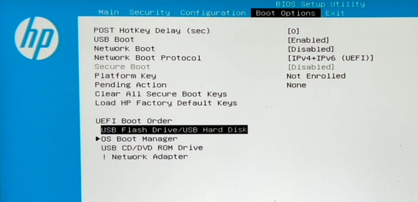
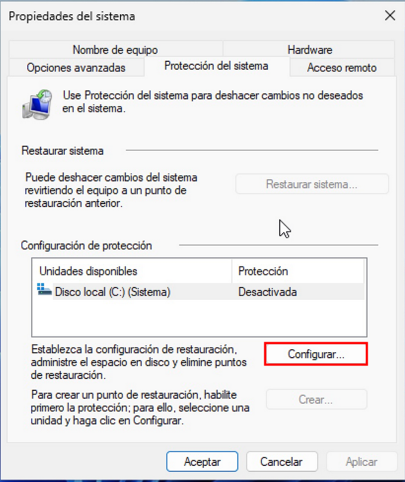
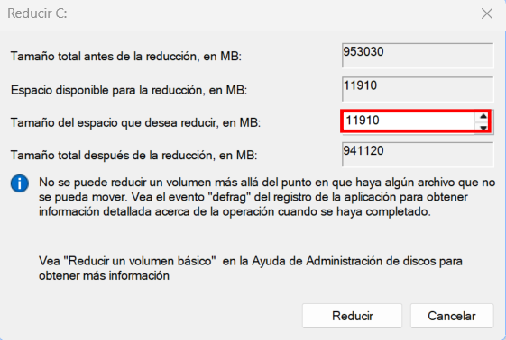
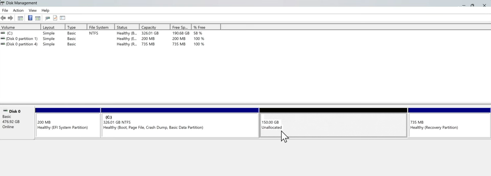

= Índice
:toc: left
:sectnums:
:toclevels: 3
:toc-title: 

<<<

== Introducción

En esta guía aprenderemos a instalar y utilizar un sistema operativo Linux, así como a comprender sus principales ventajas y desventajas frente a otros sistemas. A lo largo del contenido se abordarán aspectos fundamentales como la gestión de paquetes, las configuraciones más habituales y la personalización del entorno, proporcionando una visión general y práctica del ecosistema Linux.

// Poner imagen

<<<

== Aspectos principales de distros Linux (Ubuntu vs Arch)

Aunque todas las distribuciones Linux comparten una base común, pueden diferir notablemente en aspectos clave de su funcionamiento. A continuación, veremos algunos de los elementos más importantes, tomando de referencia a Ubuntu y Arch Linux.

=== Gestión de paquetes

La gestión de paquetes es uno de los pilares fundamentales de cualquier distribución Linux. Define cómo se instala, actualiza y mantiene el software del sistema.

* Ubuntu utiliza APT (_Advanced Package Tool_), un sistema estable que gestiona paquetes precompilados desde repositorios oficiales. Su principal ventaja es la fiabilidad y la facilidad de uso, lo que permite instalar y actualizar software de forma segura y sencilla.

* Arch Linux emplea Pacman, un gestor de paquetes ligero y rápido que combina simplicidad y potencia. Además, Arch ofrece acceso al AUR (_Arch User Repository_), un repositorio mantenido por la comunidad que amplía enormemente la cantidad de software disponible, aunque requiere mayor responsabilidad por parte del usuario.

=== Modelo de actualizaciones

El modelo de actualizaciones determina la frecuencia con la que el sistema recibe nuevas versiones de software y correcciones de seguridad.

* Ubuntu sigue un modelo de lanzamientos periódicos, con versiones LTS que priorizan la estabilidad y cuentan con soporte prolongado. Este enfoque reduce el riesgo de fallos y es adecuado para entornos donde la fiabilidad es prioritaria.

* Arch Linux utiliza un modelo de _rolling release_, en el que el sistema se actualiza de forma continua. Esto permite disponer siempre de las versiones más recientes del software, a costa de requerir una mayor atención durante las actualizaciones. *IMPORTANTE !!!*

=== Filosofía del sistema

La filosofía de una distribución influye directamente en la experiencia del usuario y en el grado de control que este tiene sobre el sistema.

* Ubuntu está orientado a ofrecer un sistema completo y funcional desde el primer momento. Incluye herramientas y configuraciones pensadas para simplificar el uso diario y minimizar la necesidad de intervención técnica.

* Arch Linux se basa en la filosofía KISS (_Keep It Simple, Stupid_), proporcionando un sistema mínimo que el usuario debe construir y adaptar según sus necesidades. Este enfoque favorece el aprendizaje y la personalización, pero exige un mayor conocimiento técnico.

<<<

== Conceptos Básicos

En muchos casos, para estar al día en el mundo de la informática es necesario conocer y utilizar los dos sistemas operativos más extendidos: Windows y Linux. Si no resulta atractiva la opción de usar WSL o una máquina virtual —que no siempre aprovecha al máximo los recursos del hardware—, una alternativa más cercana al rendimiento *bare metal* es configurar un sistema de arranque dual o _dual boot_.

El dual boot permite instalar ambos sistemas operativos en el mismo equipo y elegir cuál arrancar cada vez que se enciende el ordenador. No obstante, es importante prestar especial atención al orden de instalación.

Si se instala Linux primero y posteriormente Windows, existe una alta probabilidad de que el gestor de arranque de Linux sea sobrescrito. Windows tiende a imponer su propio gestor de arranque, lo que puede provocar que Linux deje de ser accesible. Además, algunas actualizaciones de Windows pueden alterar la configuración del arranque y causar problemas similares.

Por este motivo, la recomendación general es instalar primero Windows y, una vez finalizada su instalación, proceder a instalar Linux. De este modo, el gestor de arranque de Linux podrá detectar ambos sistemas y gestionar correctamente el inicio del equipo.

=== Requisitos previos para Dual Boot

Antes de configurar un sistema de arranque dual, es importante preparar correctamente el equipo para evitar problemas durante la instalación o en el arranque posterior.

En primer lugar, es fundamental realizar una copia de seguridad de los datos importantes. El particionado de discos siempre conlleva cierto riesgo, y un error puede provocar la pérdida de información.

También será necesario disponer de espacio libre en el disco duro o SSD. Esto suele implicar reducir la partición de Windows para dejar espacio suficiente donde instalar Linux. Esta operación puede realizarse desde el propio administrador de discos de Windows.

Otro requisito clave es contar con un medio de instalación de Linux, normalmente una memoria USB arrancable. Para ello se utiliza una imagen ISO de la distribución elegida y una herramienta de creación de medios de arranque.

Por último, conviene asegurarse de que el sistema está configurado para arrancar desde dispositivos externos y conocer el modo de arranque que utiliza el equipo (UEFI o BIOS), ya que esto influirá directamente en el proceso de instalación.

<<<

=== UEFI, BIOS y Secure Boot

Los sistemas modernos utilizan principalmente UEFI como método de arranque, en sustitución del antiguo BIOS. UEFI ofrece ventajas como tiempos de arranque más rápidos, soporte para discos de gran tamaño y un sistema de arranque más flexible.

Sin embargo, UEFI introduce un elemento adicional a tener en cuenta: Secure Boot. Esta función está diseñada para evitar que se ejecute software no autorizado durante el arranque del sistema, lo que mejora la seguridad, pero puede complicar la instalación de algunas distribuciones Linux.

Muchas distribuciones populares, como Ubuntu, son compatibles con Secure Boot, mientras que otras pueden requerir desactivarlo temporalmente desde la configuración del firmware del equipo.

En entornos de dual boot, lo más habitual es mantener ambos sistemas instalados en el mismo modo de arranque (preferiblemente UEFI) y, si surgen problemas, desactivar Secure Boot durante la instalación de Linux. Una vez finalizada la instalación, se puede volver a evaluar si es necesario mantenerlo desactivado.

==== La partición EFI (ESP)

En sistemas modernos con UEFI, el disco debe incluir una **partición EFI**, también llamada **ESP (EFI System Partition)**. Esta partición es fundamental para que el firmware del equipo pueda arrancar el sistema operativo correctamente.

Características principales:

- Contiene los **archivos de arranque** de todos los sistemas instalados (Windows, Linux, etc.).
- Suele ocupar entre **100 y 500 MB**.
- Debe estar formateada en **FAT32**, ya que es compatible con UEFI.
- Es **necesaria tanto para Windows como para Linux** si se utiliza UEFI.

En un escenario de **dual boot**, Windows crea automáticamente la partición EFI durante su instalación. Al instalar Linux posteriormente, el instalador detectará la partición EFI existente y añadirá sus propios archivos de arranque allí, de modo que el gestor de arranque de Linux (GRUB) pueda ofrecer un menú con ambos sistemas.

> Es importante **no formatear la partición EFI existente** al instalar Linux, ya que esto podría impedir que Windows arranque correctamente.

<<<

=== Esquema de particiones recomendado

Antes de instalar Linux, es fundamental comprender cómo se organiza el disco y qué esquemas de partición existen.

==== MBR y GPT

* *MBR (Master Boot Record)**  
MBR es el esquema de partición tradicional. Se encuentra al inicio del disco y contiene la información del arranque y la tabla de particiones. Sus principales características son:

- Soporta discos de hasta 2 TB.
- Permite un máximo de 4 particiones primarias.
- Compatible con BIOS antiguo y con la mayoría de sistemas operativos modernos.
  
* *GPT (GUID Partition Table)**  
GPT es el esquema de partición moderno, diseñado para superar las limitaciones de MBR. Sus ventajas incluyen:

- Soporte para discos de más de 2 TB.
- Permite un número prácticamente ilimitado de particiones.
- Compatible con UEFI.
- Incluye redundancia y sumas de verificación para proteger la tabla de particiones.

> En sistemas modernos con UEFI, GPT es la opción recomendada, mientras que MBR se utiliza principalmente en equipos antiguos con BIOS.

<<<

==== Métodos de partición y LVM

Linux permite diferentes formas de organizar el espacio en disco más allá de la tabla de particiones:

* *Particionamiento estándar**  
Consiste en crear particiones fijas para cada directorio o uso: `/`, `/home`, `/boot`, `swap`, etc. Es simple y fácil de comprender, pero menos flexible si quieres cambiar tamaños más adelante.

* *LVM (Logical Volume Manager)**  
LVM introduce un nivel de abstracción que permite:

- Combinar varios discos físicos en un grupo de volúmenes (VG).
- Crear volúmenes lógicos (LV) dentro de ese grupo.
- Redimensionar volúmenes de manera flexible sin tener que recrear particiones.
- Tomar snapshots para respaldos y pruebas.

LVM es especialmente útil si planeas cambiar tamaños de particiones con frecuencia o manejar múltiples discos de manera eficiente.

image::assets/dualboot/mbrgpt.png[alt=diagramaMbrGpt,width=400,align=center]
image::assets/dualboot/lvm.jpg[alt=diagramaLVM,width=350,align=center]

<<<

== Instalaciones Linux

En esta sección aprenderemos a instalar distintas distribuciones Linux, configurar dual boot y entender los conceptos necesarios para empezar a utilizarlas correctamente.

=== Prerrequisitos

==== Preparar USB

Para crear un USB booteable necesitamos una **ISO de Arch Linux** y una herramienta para flashear:

- Descarga la ISO recomendada para tu país:  
https://archlinux.org/download/[Arch Linux ISO]

- Herramientas para preparar el USB:
  - **Rufus**: https://rufus.ie/en/[Rufus]
  - **Ventoy** (recomendado): https://www.ventoy.net/en/index.html[Ventoy]
    
> Permite tener varias ISOs en un solo USB sin necesidad de flashear constantemente.

==== BIOS / UEFI

Antes de iniciar la instalación, debemos configurar la BIOS para arrancar desde el USB:

1. Entra en la BIOS del equipo.  
2. Coloca el USB como primera opción de arranque.  
3. (Opcional) Activa la virtualización si lo deseas.  
+

+
4. Guarda los cambios. Al reiniciar, deberías ver el menú de instalación de Arch.  

> Si el equipo arranca directamente en Windows, otra opción es presionar **Shift + Reiniciar** desde Windows, lo que permite iniciar desde otro dispositivo y seleccionar el USB.

<<<

=== Dual Boot

==== Punto de restauración

Antes de hacer cualquier cambio, es recomendable guardar todos nuestros datos de Windows mediante un **Punto de Restauración** (_System Restore Point_). Esto nos permitirá recuperar el sistema en caso de algún error durante la instalación de Linux.

1. Buscamos la herramienta de **Punto de Restauración**:
+
image::assets/instalacion/prestauracion/busqueda.png[alt=busqueda,width=400,align=center]
+
2. Si la protección del sistema está desactivada, debemos configurarla:
+

+
<<<
+
3. En la ventana emergente, seleccionamos la unidad, activamos la protección y aplicamos los cambios:
+
image::assets/instalacion/prestauracion/establecer.png[alt=configuracion2,width=350,align=center]
+
4. Finalmente, creamos un punto de restauración y le asignamos un nombre:
+
[cols="1a,1a", frame=none, grid=none]
|===
| image::assets/instalacion/prestauracion/crear.png[alt=crear,width=350]
| image::assets/instalacion/prestauracion/nombre.png[alt=nombrar,width=350]
|===

> Una vez activada, Windows creará automáticamente imágenes del sistema en momentos importantes, como antes de instalar software.

==== Particionar Windows

Para liberar espacio para Linux, abrimos el **Administrador de discos** haciendo clic derecho sobre el icono de Windows:

image::assets/instalacion/particionar/Adiscos.png[alt=acceder,width=200,align=center]

Como ya vimos en la teoría:

image::assets/instalacion/particionar/particiones.png[alt=particiones,align=center]

<<<

Para reducir la partición C:

1. Haz clic derecho sobre la partición C y selecciona **Reducir volumen**.  
2. Introduce el tamaño en MB del espacio que quieres reservar para Linux:

Después de reducir, veremos el espacio libre listo para Linux:

> No formatees ni crees particiones en este espacio. Esto se hará durante la instalación de Arch Linux.

<<<

=== Arch Linux 

Con esto claro y habiendo comprendido la teoría sobre particiones, UEFI, GPT y LVM, estamos listos para pasar a la instalación.

==== Instalación

Una vez iniciado desde el medio de instalación de Arch Linux, seleccionamos la opción:

*Arch Linux install medium*

Deberíamos ver una pantalla similar a la siguiente:

image::assets/instalacion/install/root.png[alt=bios,align=center]

> Si estás usando un portátil, es un buen momento para configurar la red Wifi, el Bluetooth y otros dispositivos antes de continuar con la instalación.

Antes de nada, conviene cambiar el **keymap** del sistema para que coincida con nuestro teclado:

[source,bash]
----
# localectl list-keymaps       # Lista todos los mapas de teclado disponibles
# loadkeys {keymap}           # Sustituye {keymap} por el que necesites, por ejemplo "es"
----

Esto evita problemas al escribir contraseñas o comandos durante la instalación.

Si queremos mejorar la visibilidad en la consola y no “quedarnos ciegos” al trabajar en modo texto, podemos cambiar la fuente de la consola con:

[source,bash]
----
# setfont ter-132n
----

<<<

===== Conexión Wifi

Primero, comprobamos si tenemos conexión a Internet haciendo un ping a Google:

[source,bash]
----
# ping -c 5 google.com
----

Si no recibimos respuesta, configuraremos la conexión Wifi usando `iwctl`. Este comando nos introduce en una subshell interactiva de iwd:

[source,bash]
----
$ iwctl
[iwd]# 
----

Para ver las interfaces Wifi disponibles:

[source,bash]
----
[iwd]# device list
----

Identifica tu tarjeta (por ejemplo `wlan0`). Debe estar **encendida**; si no, activamos la tarjeta con:

[source,bash]
----
[iwd]# device wlan0 set-property Powered on
----

Ahora podemos escanear las redes disponibles:

[source,bash]
----
[iwd]# station wlan0 get-networks
----

Conecta a la red deseada (sustituye `{wifi}` por el nombre de tu red):

[source,bash]
----
[iwd]# station wlan0 connect {wifi}
----

Introduce la contraseña cuando te la solicite.  

Una vez conectado, salimos de `iwctl`:

[source,bash]
----
[iwd]# exit
----

Finalmente, verificamos que la conexión funciona:

[source,bash]
----
# ping -c 5 google.com
----

<<<

===== Actualizar y verificar archivos de instalación

Antes de iniciar la instalación, sincronizamos la base de datos de paquetes y descargamos los paquetes necesarios:

[source,bash]
----
# pacman -Sy
# pacman -S archlinux-keyring archinstall
----

> El paquete `archlinux-keyring` es importante para garantizar que los paquetes descargados sean verificados correctamente.

En caso de error ModuleNotFoundError ver https://www.youtube.com/watch?v=Lk0xbCQU9h0[video].

===== Particionar la partición

Antes de instalar Linux, debemos preparar el disco y crear las particiones necesarias. Para ver cómo están actualmente, usamos:

[source,bash]
----
# lsblk
----

Normalmente, los discos NVMe aparecerán con nombres como `nvme0n1` y los USB como `sda`. Cada partición se indica con un número, por ejemplo `nvme0n1p1`.

Vamos a crear las particiones utilizando `cfdisk`:

[source,bash]
----
# cfdisk /dev/nvme0n1
----

Aparecerá una interfaz con el espacio libre (*Free space*). Para cada nueva partición, selecciona **New** y establece el tamaño correspondiente.

|===
|Partición |Tamaño |Tipo

|Boot (EFI)
|1G
|EFI System

|Resto del disco
|Resto del espacio disponible
|Linux filesystem
|===

Una vez creadas las particiones, selecciona **Write** para guardar los cambios y confirma con `yes`. Finalmente, selecciona **Quit** para salir de `cfdisk`.

<<<

===== Formatear nuevas particiones

Una vez creadas las particiones, es necesario darles formato antes de poder utilizarlas.

Para la partición EFI (1 GB aproximadamente), utilizaremos el siguiente comando:

[source,bash]
----
# mkfs.fat -F32 /dev/{particion_efi}
----

Este comando crea un sistema de archivos FAT32, obligatorio para sistemas UEFI.

Para la partición raíz (`/`), usaremos `ext4`, uno de los sistemas de archivos más comunes en Linux:

[source,bash]
----
# mkfs.ext4 /dev/{particion_root}
----

El sistema nos preguntará si queremos sobrescribir el contenido de la partición. Confirmamos escribiendo `y` y pulsamos **Enter**.

===== Montar las particiones

Ahora vamos a montar las particiones en el sistema de archivos para continuar con la instalación.

Primero montamos la partición raíz en `/mnt`:

[source,bash]
----
# mount /dev/{particion_root} /mnt
----

A continuación, creamos el punto de montaje para la partición EFI y la montamos:

[source,bash]
----
# mkdir /mnt/boot
# mount /dev/{particion_efi} /mnt/boot
----

<<<

===== Archinstall

Una vez tenemos las particiones montadas, podemos iniciar el instalador oficial de Arch Linux.

[source,bash]
----
# archinstall
----

Aparecerá un menú interactivo donde podremos configurar el sistema a nuestro gusto. Muchas opciones son intuitivas, pero hay algunas especialmente importantes que conviene revisar.

A continuación se describen las opciones más relevantes del instalador:

* *Locales:*  
  Configura el idioma del sistema, la distribución del teclado y la región.

* *Disk configuration:*  
  Define cómo se usarán las particiones creadas previamente.

  ** Seleccionamos *Pre-mounted configuration*
  ** En *Root mount point* indicamos `/mnt`
  ** Confirmamos y salimos del menú
  ** El instalador detectará automáticamente las particiones montadas.

El uso de *swap* no es estrictamente necesario si disponemos de suficiente memoria RAM, aunque puede habilitarse si se desea.

* *Bootloader:*  
  Seleccionamos **GRUB**, uno de los gestores de arranque más comunes y compatibles.

* *Hostname:*  
  Establecemos el nombre del equipo en la red.

* *Set root password:*  
  Definimos la contraseña del usuario `root`.

* *User account:*  
  Creamos un usuario normal y le otorgamos permisos de *superuser* (sudo).

* *Profile:*  
  Seleccionamos el tipo de instalación:

  ** Elegimos *Desktop*
  ** Seleccionamos el entorno de escritorio que más nos guste (Espacio para marcar, Enter para confirmar)
  ** Dentro de esta sección:

    *** *Graphics drivers*  
        Seleccionamos los controladores adecuados según nuestro hardware (Intel, AMD o NVIDIA — en este último caso hay varias opciones)

* *Audio:*  
  Seleccionamos **PipeWire**, una solución moderna y completa.

* *Network configuration:*  
  Elegimos **NetworkManager** para la gestión de la red.

* *Additional packages:*  
  Permite añadir paquetes adicionales desde el inicio.

  ** Algunos paquetes recomendados: `nano`, `git`, `fastfetch`, `htop` (Tab seleccionar, `/` buscar)

* *Timezone:*  
  Seleccionamos nuestra zona horaria.

Una vez revisado todo, seleccionamos **Install** y comenzará la instalación del sistema.

<<<

==== Postinstalación

Una vez finalizada la instalación, el instalador nos ofrecerá varias opciones.  
Seleccionamos la tercera:

*chroot into installation for post-installation configurations*

Esto nos introduce dentro del sistema recién instalado para realizar las configuraciones finales.

===== Instalar y configurar GRUB

Para poder arrancar el sistema, vamos a instalar y configurar el gestor de arranque **GRUB**.

Instalamos los paquetes necesarios:

[source,bash]
----
# pacman -S grub efibootmgr mtools dosfstools
----

Antes de continuar, comprobamos que las particiones están correctamente montadas:

[source,bash]
----
# lsblk
----

Ahora instalamos GRUB en modo UEFI, indicando la partición EFI montada en `/boot`:

[source,bash]
----
# grub-install --target=x86_64-efi --efi-directory=/boot --bootloader-id=GRUB
----

Si el comando no devuelve errores, generamos el archivo de configuración:

[source,bash]
----
# grub-mkconfig -o /boot/grub/grub.cfg
----

Con esto, el gestor de arranque queda correctamente instalado.

<<<

===== Instalar software básico

A continuación, podemos instalar algunos programas habituales para el uso diario del sistema:

[source,bash]
----
# pacman -S firefox vlc libreoffice-fresh spectacle gwenview power-profiles-daemon gcc wget curl perl flatpak
----

Breve descripción de algunos paquetes:

* *firefox*: navegador web
* *vlc*: reproductor multimedia
* *libreoffice-fresh*: suite ofimática
* *spectacle*: herramienta de capturas de pantalla (KDE)
* *gwenview*: visor de imágenes
* *power-profiles-daemon*: gestión de perfiles de energía
* *gcc*: compilador de C/C++
* *wget / curl*: descarga de archivos desde terminal
* *flatpak*: sistema de paquetes universal

===== Salir y reiniciar

Una vez finalizado todo, salimos del entorno *chroot*, desmontamos las particiones y apagamos el sistema:

[source,bash]
----
# exit
# umount -lR /mnt
# shutdown now
----

Retiramos el USB de instalación.

Es posible que el sistema vuelva a arrancar desde el medio de instalación.  
En ese caso, entramos en la BIOS/UEFI y colocamos **GRUB** como primera opción en el orden de arranque (*UEFI Boot Order*).

<<<

==== Añadir Windows a GRUB (DualBoot)

Una vez iniciemos sesión en nuestro nuevo y flamante Arch Linux, añadiremos Windows al gestor de arranque GRUB.

Abrimos una terminal. Si estamos usando KDE Plasma, podemos usar *Konsole*.

Editamos la configuración de GRUB:

[source,bash]
----
$ sudo nano /etc/default/grub
----

Dentro del archivo, podemos realizar los siguientes cambios:

* Cambiar el tiempo de espera del menú de GRUB de 5 a 30 segundos:

----
GRUB_TIMEOUT=30
----

* Buscar la línea comentada:

----
#GRUB_DISABLE_OS_PROBER=false
----

La descomentamos y comprobamos que quede así:

----
GRUB_DISABLE_OS_PROBER=false
----

Guardamos los cambios y cerramos el editor.

Ahora instalamos **os-prober**, la herramienta que permite detectar otros sistemas operativos:

[source,bash]
----
$ sudo pacman -S os-prober
----

Una vez instalado, regeneramos la configuración de GRUB:

[source,bash]
----
$ sudo grub-mkconfig -o /boot/grub/grub.cfg
----

Si todo ha ido bien, veremos un mensaje indicando que se ha encontrado **Windows Boot Manager** y que se ha añadido automáticamente al menú.

Después, reiniciamos el sistema. Al arrancar, GRUB nos permitirá elegir entre Arch y Windows.

[source,bash]
----
$ sudo reboot
----

<<<

==== Gestión de paquetes con pacman

`pacman` es el gestor de paquetes oficial de Arch Linux.  
Se encarga de instalar, actualizar, eliminar y consultar paquetes provenientes de los repositorios oficiales.

Una de las características principales de pacman es su simplicidad:  
un solo comando, una sola herramienta y una base de datos centralizada.

Es recomendable ver como se usan los https://wiki.archlinux.org/title/Pacman/Rosetta[comandos], más adelante veremos los más utilizados.

===== Repositorios oficiales

Arch Linux cuenta con varios repositorios oficiales, entre los más importantes:

* *core*: paquetes esenciales para el sistema
* *extra*: software adicional ampliamente utilizado
* *community*: paquetes mantenidos por la comunidad de Arch

Los paquetes de estos repositorios están **precompilados**, firmados y listos para instalar.

===== Actualizar el sistema

En Arch Linux, el sistema se actualiza siempre de forma completa.

[source,bash]
----
$ sudo pacman -Syu
----

Este comando:
* Sincroniza la base de datos de paquetes
* Actualiza todos los paquetes instalados
* Aplica parches de seguridad y nuevas versiones

===== Instalar paquetes

Para instalar un paquete desde los repositorios oficiales:

[source,bash]
----
$ sudo pacman -S nombre_paquete
----

Ejemplo:

[source,bash]
----
$ sudo pacman -S nano
----

<<<

===== Eliminar paquetes

Para eliminar un paquete:

[source,bash]
----
$ sudo pacman -R nombre_paquete
----

Si queremos eliminar el paquete junto con sus dependencias que ya no se usan:

[source,bash]
----
$ sudo pacman -Rs nombre_paquete
----

===== Buscar paquetes

Para buscar paquetes en los repositorios:

[source,bash]
----
$ pacman -Ss nombre
----

Para buscar entre los paquetes ya instalados:

[source,bash]
----
$ pacman -Qs nombre
----

===== Información sobre paquetes

Para ver información detallada de un paquete:

[source,bash]
----
$ pacman -Qi nombre_paquete
----

Para listar todos los archivos que instala un paquete:

[source,bash]
----
$ pacman -Ql nombre_paquete
----

===== Limpieza del sistema

Con el tiempo, pacman guarda versiones antiguas de los paquetes en caché.

[source,bash]
----
$ sudo pacman -Sc
----

Para una limpieza más agresiva (usar con precaución):

[source,bash]
----
$ sudo pacman -Scc
----

<<<

==== Arch User Repository (AUR)

La *Arch User Repository* (AUR) es uno de los pilares fundamentales del ecosistema Arch Linux.  
Se trata de un repositorio mantenido por la comunidad que contiene descripciones de paquetes que no se encuentran en los repositorios oficiales.

A diferencia de los repositorios oficiales, la AUR **no distribuye paquetes binarios**.  
En su lugar, proporciona archivos llamados *PKGBUILD*, que describen cómo descargar, compilar e instalar un programa en el sistema.

===== ¿Qué es un PKGBUILD?

Un *PKGBUILD* es un script que define todos los pasos necesarios para crear un paquete instalable por `pacman`.

Entre otras cosas, especifica:

* El nombre y la versión del paquete
* Las dependencias necesarias
* Desde dónde descargar el código fuente
* Cómo compilar el programa
* Qué archivos se instalarán en el sistema

Cuando instalamos un paquete desde la AUR, lo que realmente ocurre es que:

. Se descarga el *PKGBUILD*
. Se revisa (opcional pero recomendado)
. Se compila el software localmente
. Se genera un paquete compatible con `pacman`
. El paquete se instala en el sistema

===== ¿Por qué existe la AUR?

La AUR permite a la comunidad compartir software que:

* No cumple los requisitos para estar en los repositorios oficiales
* Es software propietario (como Google Chrome)
* Tiene versiones *-git*, *-beta* o experimentales
* Es muy específico o poco utilizado

Gracias a la AUR, Arch Linux dispone de uno de los catálogos de software más amplios del mundo Linux.

===== Seguridad y buenas prácticas

Dado que los paquetes de la AUR son mantenidos por la comunidad, es importante tener en cuenta algunas consideraciones:

* No todos los paquetes están auditados oficialmente
* Es recomendable revisar el *PKGBUILD* antes de instalar
* Evitar instalar paquetes AUR como usuario `root`
* Comprobar la reputación del mantenedor y los votos del paquete

En general, la AUR es segura si se utiliza con sentido común y se siguen buenas prácticas.

===== Relación entre pacman y la AUR

`pacman` **no puede instalar paquetes directamente desde la AUR**.  
Esto se debe a que pacman trabaja con paquetes binarios ya compilados.

Para facilitar el uso de la AUR, existen herramientas llamadas *AUR helpers*, que automatizan el proceso de descarga, compilación e instalación.  
Uno de los más populares es **yay**, que se explica en la siguiente sección.

<<<

==== Yay: gestor de paquetes para la AUR

`yay` es una herramienta conocida como *AUR helper*.  
Su función principal es facilitar la instalación y gestión de paquetes provenientes de la AUR, integrándolos en un flujo de trabajo muy similar al de `pacman`.

Con `yay` podemos:

* Buscar paquetes en los repositorios oficiales y en la AUR
* Descargar y compilar paquetes de la AUR
* Instalar, actualizar y eliminar paquetes
* Revisar y editar los *PKGBUILD* antes de instalar

Se puede ver más información en el repositorio oficial https://github.com/Jguer/yay[yay].

===== ¿Por qué usar yay?

Aunque es posible instalar paquetes de la AUR de forma manual, el proceso puede resultar tedioso si se hace con frecuencia.  
`yay` automatiza estos pasos manteniendo la transparencia del proceso.

Es importante destacar que `yay` **no sustituye a pacman**, sino que lo complementa.

===== Instalación de yay

Para instalar `yay`, necesitamos previamente los paquetes necesarios para compilar software:

[source,bash]
----
$ sudo pacman -S --needed base-devel git
----

Descargamos el repositorio de `yay` desde la AUR:

[source,bash]
----
$ git clone https://aur.archlinux.org/yay.git
$ cd yay
----

Compilamos e instalamos el paquete:

[source,bash]
----
$ makepkg -si
----

Una vez finalizado, `yay` estará disponible en el sistema.

<<<

===== Uso básico de yay

Instalar un paquete desde la AUR:

[source,bash]
----
$ yay -S nombre_paquete
----

- Ejemplo:

[source,bash]
----
$ yay -S google-chrome
----

Actualizar todo el sistema (repositorios oficiales + AUR):

[source,bash]
----
$ yay -Syu
----

Eliminar un paquete:

[source,bash]
----
$ yay -R nombre_paquete
----

Buscar paquetes:

[source,bash]
----
$ yay nombre_paquete
----

===== Interacción con PKGBUILD

Cuando instalamos un paquete desde la AUR, `yay` mostrará el contenido del *PKGBUILD* y nos pedirá confirmación antes de continuar.

Este paso permite:

* Revisar qué acciones se van a ejecutar
* Detectar posibles comandos sospechosos
* Mantener el control sobre lo que se instala en el sistema

Es recomendable **no saltarse esta revisión**, especialmente al instalar paquetes nuevos.

===== ¿Cuándo usar pacman y cuándo usar yay?

* Paquetes disponibles en repositorios oficiales → **pacman**
* Paquetes que solo están en la AUR → **yay**

Utilizar `yay` para todo no es un problema, pero entender qué herramienta usar en cada caso es parte de la filosofía de Arch Linux.

<<<

=== QubesOS (En proceso)

En este apartado se explicará cómo instalar, usar y crear un ecosistema adecuado para trabajar en QubesOs

<<<

== Conceptos generales de Linux

Esta sección aborda conceptos y herramientas comunes a la mayoría de distribuciones Linux modernas.
El objetivo es mejorar la comprensión del sistema y optimizar la experiencia de uso, independientemente de la distribución utilizada.

=== Servicios y systemd (En revisión !!!)

La mayoría de distribuciones actuales utilizan **systemd** como sistema de inicio y gestor de servicios.

Un servicio es un proceso que se ejecuta en segundo plano y proporciona alguna funcionalidad al sistema, como la red, el audio o el servidor de impresión.

==== Gestión básica de servicios

Iniciar un servicio:

[source,bash]
----
$ sudo systemctl start nombre_servicio
----

Detener un servicio:

[source,bash]
----
$ sudo systemctl stop nombre_servicio
----

Habilitar un servicio al arranque:

[source,bash]
----
$ sudo systemctl enable nombre_servicio
----

Deshabilitar un servicio:

[source,bash]
----
$ sudo systemctl disable nombre_servicio
----

Comprobar el estado de un servicio:

[source,bash]
----
$ systemctl status nombre_servicio
----

Listar servicios activos:

[source,bash]
----
$ systemctl list-units --type=service
----

==== Ejemplos comunes de servicios

* `NetworkManager` - gestión de red
* `sshd` - acceso remoto por SSH
* `cups` - impresión
* `firewalld` / `ufw` - firewall
* `bluetooth` - soporte Bluetooth

=== Firewall en Linux (En revisión !!)

Un firewall permite controlar qué conexiones entrantes y salientes están permitidas en el sistema, aumentando la seguridad.

Linux utiliza internamente **netfilter**, pero normalmente se gestiona a través de herramientas más simples.

==== UFW (Uncomplicated Firewall)

UFW es una herramienta sencilla y muy popular, especialmente en entornos de escritorio.

Instalación:

[source,bash]
----
$ sudo pacman -S ufw
----

Activar el firewall:

[source,bash]
----
$ sudo ufw enable
----

Comprobar el estado:

[source,bash]
----
$ sudo ufw status
----

Permitir un servicio o puerto:

[source,bash]
----
$ sudo ufw allow ssh
$ sudo ufw allow 80
----

Bloquear un puerto:

[source,bash]
----
$ sudo ufw deny 23
----

==== Firewalld

Firewalld es una alternativa más avanzada, común en entornos empresariales.

Permite gestionar reglas mediante zonas y servicios, sin necesidad de reiniciar el firewall al aplicar cambios.

=== Gestión de usuarios y permisos

Linux es un sistema multiusuario, por lo que la gestión de permisos es fundamental.

==== Permisos de archivos

Cada archivo tiene tres tipos de permisos:

* Lectura (r)
* Escritura (w)
* Ejecución (x)

Y tres niveles:

* Usuario
* Grupo
* Otros

Ver permisos:

[source,bash]
----
$ ls -l
----

Cambiar permisos:

[source,bash]
----
$ chmod 755 archivo
----

Cambiar propietario:

[source,bash]
----
$ sudo chown usuario:grupo archivo
----

<<<

=== Procesos y rendimiento (En revisión !)

Linux ofrece herramientas muy potentes para supervisar el sistema.

Comandos útiles:

[source,bash]
----
$ top
$ htop
$ ps aux
$ kill PID
$ uptime
----

Estas herramientas permiten identificar procesos problemáticos, consumo excesivo de recursos y el estado general del sistema.

=== Copias de seguridad (En revisión !!)

// Explicar teoria de los modelos de copias que hay, tambien las task y quotas

Realizar copias de seguridad periódicas es una de las prácticas más importantes para cualquier sistema, independientemente del sistema operativo.

Una buena copia de seguridad permite recuperar el sistema o los datos ante:

* Fallos de hardware
* Errores humanos
* Actualizaciones fallidas
* Ataques o corrupción de datos

==== Qué respaldar

Como norma general, es recomendable hacer copias de:

* El directorio `/home`
* Archivos de configuración importantes (`/etc`)
* Datos personales (documentos, fotos, proyectos)
* Configuraciones específicas de aplicaciones

Evita hacer copias completas del sistema sin un motivo claro, ya que suelen ser innecesarias y ocupan mucho espacio.

<<<

==== Estrategia básica de backups

Una estrategia sencilla y efectiva puede ser:

* Copias regulares (diarias o semanales)
* Almacenamiento externo (USB, disco externo, NAS)
* Mantener más de una versión de los archivos
* No guardar la copia en el mismo disco que los datos originales

==== Backups con rsync

`rsync` es una de las herramientas más utilizadas en Linux para realizar copias de seguridad incrementales.

Ejemplo básico para respaldar el directorio personal:

[source,bash]
----
$ rsync -avh --delete /home/usuario/ /ruta/al/backup/home/
----

Opciones utilizadas:

* `-a`: modo archivo (permisos, enlaces, fechas)
* `-v`: salida detallada
* `-h`: tamaños legibles
* `--delete`: elimina archivos del destino que ya no existen en el origen

==== Automatizar copias con cron

Para automatizar los backups, podemos usar `cron`.

Editar el cron del usuario:

[source,bash]
----
$ crontab -e
----

Ejemplo de copia diaria a las 02:00:

[source,bash]
----
0 2 * * * rsync -avh /home/usuario/ /ruta/al/backup/home/
----

<<<

==== Timeshift

Timeshift es una herramienta orientada a copias del sistema, muy útil para recuperar el sistema tras una actualización fallida.

Está pensada principalmente para:

* Archivos del sistema
* Configuraciones
* Restauración rápida

Instalación:

[source,bash]
----
$ sudo pacman -S timeshift
----

Timeshift **no sustituye** a las copias del directorio `/home`, sino que las complementa.

<<<

// SSH, Logs y journalctl, puertos, explicar cuestiones de DNS, ISP, redes

// == Videos recomendados (En revisión !!!)

// Pacman:

// * https://www.youtube.com/watch?v=Napx5_6iBJ4[pacman guide]
// * https://www.youtube.com/watch?v=-puvglgx6Qs[post-install guide]

// Navegadores:

// * https://www.youtube.com/watch?v=3gkmx3ixUXE[Librewolf browser]
// * https://www.youtube.com/watch?v=2ssECcbhjJc[privacy browsers]

// Seguridad y Privacidad (No tiene que ver con Linux):

// * Degoogle:
// ** https://www.youtube.com/watch?v=YnSv8ylLfPw[Linus Tech Part1]
// ** https://www.youtube.com/watch?v=YaMc64IAC8g[Linus Tech Part2]
// ** https://www.youtube.com/watch?v=u_Lxkt50xOg[PewDiePie]
// ** https://www.youtube.com/watch?v=XOcfMVXmkfM[The Hated One]
// * Proton vs Tuta:
// ** https://www.youtube.com/watch?v=_QdBAa6N3C8[Proton problems]
// * GrapheneOS:
// ** https://www.youtube.com/watch?v=X-CKcQMt7v4[Tutorial]
// ** https://www.youtube.com/watch?v=dPXu-XKxBT4[post-install GrapheneOS]

// Otras Cosas:

// * https://www.youtube.com/watch?v=oTOu7VfXnl8[music player]

<<<

== Final
[quote, Séneca]
____
No nos atrevemos a muchas cosas porque son difíciles, pero son difíciles porque no nos atrevemos a hacerlas.
____
